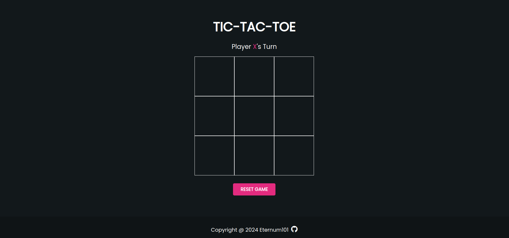
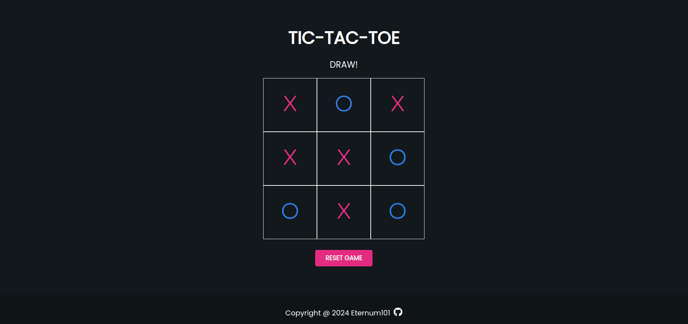
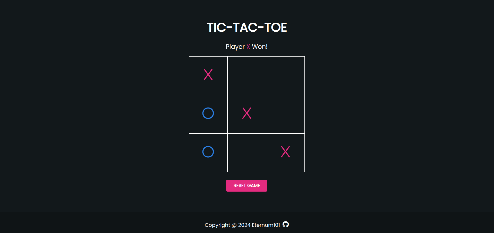

# Tic Tac Toe

🔗 [View Demo](https://eternum101.github.io/tic-tac-toe/)

## Table of Contents
- [About The Project](#about-the-project)
- [Built With](#built-with)
- [Screenshots](#screenshots)
- [Features](#features)

## About The Project
A Variation of the Tic-Tac-Toe Game.

## Screenshots

### Initial Screen

### Draw Result

### Overall Result

[Back to Top](#tic-tac-toe)

## Built With
- HTML
- CSS
- JavaScript

[Back to Top](#tic-tac-toe)

## Features

- Player Vs Player System
- Checks for When the Game is Over
- Ability to Click on Board Square to Place Marker
- Ability to Reset Game
- Dark User Interface

[Back to Top](#tic-tac-toe)

